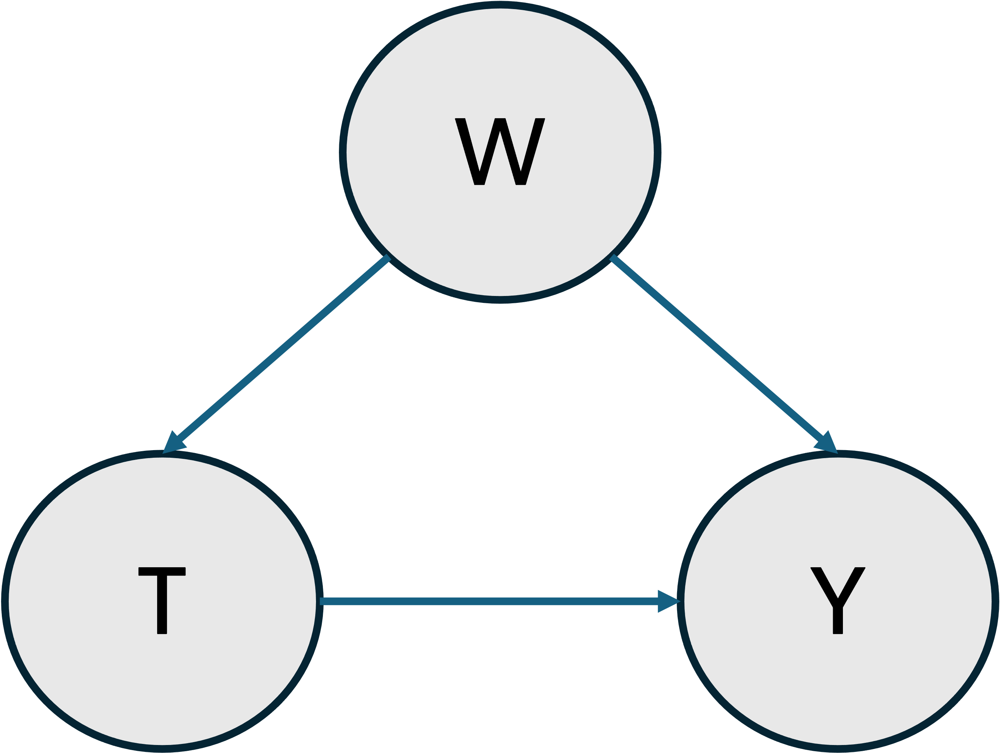

```@meta
EditURL = "../../../examples/case_control_experiment.jl"
```

# Case–Control Design and Biased Sampling

In this example we aim to present a strategy for estimating causal parameters
in experiments with biased sampling designs. The most well-known of these designs
in practice is the case-control study. Unfortunately, this bias in the sampling mechanism
will result in a systematic bias in the associated causal effects. However, the TMLE
framework provides a way to adjust for this bias. The main requirement for this adjustment
is knowledge of the true population prevalence of the outcome (``q_0``). In TMLE.jl, this can be
provided to the `Tmle` estimator via the `prevalence` keyword argument.
We will call the resulting estimator the CCW-TMLE.

## Data Generating Process

Let's consider the following structural causal model for our full-data generating
distribution $P_{X,0}$, in which there are no unobserved counfounders.



Let's assume the following generating process where the set of confounders `W` is a binary random variable, `T` is a binary
treatment variable dependent on `W` and `Y` is the binary outcome dependent on both `T` and `W`.

```math
\begin{aligned}
W \sim \mathcal{Bernoulli}(0.5) \\
T \sim \mathcal{B}(\frac{1}{1 + e^{0.2 - 0.8\cdot W}}) \\
Y \sim \mathcal{B}(\frac{1}{1 + e^{3.0 - log(2.0)\cdot T - log(1.5)\cdot W}})
\end{aligned}
```

And here the observations drawn from $P_{X,0}$ are denoted as $X = (W, T, Y)$.

````@example case_control_experiment
using Random
using DataFrames
using Distributions
using Statistics
using MLJBase
using CategoricalArrays
using CairoMakie
using TMLE

α, β, γ = -3.0, log(2.0), log(1.5)
pT_given_W(w) = 1 / (1 + exp(-(-0.2 + 0.8*w)))
pY_given_T_W(t, w) = 1 / (1 + exp(-(α + β*t + γ*w)))

function generate_population(;n=2_000_000)
    W = rand(Bernoulli(0.5), n)
    T = [rand(Bernoulli(pT_given_W(w))) for w in W]
    Y = [rand(Bernoulli(pY_given_T_W(a, w))) for (a, w) in zip(T, W)]
    return DataFrame(W=W, T=T, Y=Y)
end

Random.seed!(42)

pop = generate_population()

first(pop, 5)
````

## Sampling Bias
We then define a biased sampling strategy to simulate an independent case-control study with case (Y = 1) prevalence of a specified `q`.
As a consequence of this sampling design our observed data structure for the experimental unit or set of observations will be represented by the following form:
``O = ((W_1, T_1), (W^{j}_0, T^{j}_0):j=1...J) \sim P_0``, where ``(W_1, T_1) \sim P₀|Y=1`` and ``(W^{j}_0, T^{j}_0) \sim P₀|Y=0``.

````@example case_control_experiment
function subsample_case_control(
    pop::DataFrame,
    q::Float64;
    n::Int = 100_000,
    outcome_col::Symbol = :Y,
    rng::AbstractRNG = Random.GLOBAL_RNG,
    )
    n_case = round(Int, q * n)
    n_ctl  = n - n_case
    y = pop[!, outcome_col]
    case_idx = findall(y .== 1)
    ctl_idx  = findall(y .== 0)
    sel_cases = shuffle(rng, case_idx)[1:n_case]
    sel_ctls  = shuffle(rng, ctl_idx)[1:n_ctl]
    sample = pop[vcat(sel_cases, sel_ctls), :]
    sample.T = categorical(sample.T)
    sample.Y = categorical(sample.Y)
    return sample
end

subsample_case_control(pop, 0.1; n = 5)
````

We define a function to estimate the ATE using both the canonical TMLE and CCW-TMLE from the biased sample.
Here, the CCW-TMLE is provided with the true population prevalence `q₀`. With this information, the CCW-TMLE
can reconstruct the true population structure in the presence of biased sampling allowing for the estimation
of the true population ATE. On the other hand, the canonical TMLE will estimate an ATE that is dependent on the
observed population with a biased sturcture.

````@example case_control_experiment
function estimate_Ψ(sample::DataFrame, q0::Float64)
    Ψ = ATE(
    outcome = :Y,
    treatment_values = (T=(case=1, control=0),),
    treatment_confounders = (T=[:W],)
    )
    canonical_tmle = Tmle(weighted=false)
    ccw_tmle  = Tmle(prevalence=q0, weighted=false)
    canon_estimate, _ = canonical_tmle(Ψ, sample; verbosity=0)
    ccw_estimate, _   = ccw_tmle(Ψ, sample; verbosity=0)
    return canon_estimate, ccw_estimate
end
````

## CCW–TMLE vs Canonical TMLE in the Presence of Sampling Bias

To illustrate, we select various levels of case-control prevalences `q` and compare the estimates from both the canonical TMLE and CCW-TMLE.
Because we know the true generating process and population, both the true causal effect and prevalence are known.

````@example case_control_experiment
q₀ = mean(pop.Y)
W = pop.W
π1 = pY_given_T_W.(1, W)
π0 = pY_given_T_W.(0, W)
true_RD = mean(π1 .- π0)
````

The following code performs the following operations:
1. For each prevalence `q`, it generates a case-control subsample and estimates the average treatment effect with both the canonical TMLE and CCW-TMLE.
2. It plots the estimation results.

````@example case_control_experiment
function ribbon!(ax, x, y, ylow, yhigh; color, label=nothing)
    band!(ax, x, ylow, yhigh, color=(color, 0.25))
    lines!(ax, x, y, color=color, label=label, linewidth=2)
end

function sampling_bias_analysis(
    pop::DataFrame,
    n::Int,
    sampling_range::Tuple{Float64,Float64},
    n_studies::Int,
    q0::Float64,
    true_Ψ::Float64;
    rng=Random.GLOBAL_RNG
)
    q_min, q_max = sampling_range
    qs = exp.(range(log(q_min), log(q_max), length=n_studies))

    results = DataFrame(q=Float64[],
                        method=String[],
                        estimate=Float64[],
                        lower=Float64[],
                        upper=Float64[])

    for q in qs
        sample = subsample_case_control(pop, q; n=n, rng=rng)
        est_plain, est_ccw = estimate_Ψ(sample, q0)
        ci_plain = confint(significance_test(est_plain))
        ci_ccw   = confint(significance_test(est_ccw))
        push!(results, (q, "TMLE", est_plain.estimate, ci_plain[1], ci_plain[2]))
        push!(results, (q, "CCW–TMLE", est_ccw.estimate, ci_ccw[1], ci_ccw[2]))
    end

    fig = Figure(resolution=(800,500))
    ax = Axis(fig[1,1], title="Sampling Bias: Standard vs CCW–TMLE",
              xlabel="Sampling prevalence q",
              ylabel="ATE (risk difference)")
    df_plain = filter(:method => ==("TMLE"), results)
    ribbon!(ax, df_plain.q, df_plain.estimate, df_plain.lower, df_plain.upper;
            color=:dodgerblue, label="Standard TMLE")
    df_ccw = filter(:method => ==("CCW–TMLE"), results)
    ribbon!(ax, df_ccw.q, df_ccw.estimate, df_ccw.lower, df_ccw.upper;
            color=:orange, label="CCW–TMLE")
    hlines!(ax, [true_Ψ], color=:black, linestyle=:dash, label="True ATE")
    vlines!(ax, [q0], color=:red, linestyle=:dot, label="True q₀")
    axislegend(ax, position=:rb)
    return results, fig
end

results, figure = sampling_bias_analysis(pop, 100_000, (0.01, 0.5), 8, q₀, true_RD)
figure
````

Interpretation:
- Standard TMLE estimates are increasingly baised as sampling prevalence deviates from q₀ because the
  empirical distribution over- or under-represents cases.
- CCW–TMLE with the true q₀ remains stable across sampling prevalences.

This demonstrates how with knowlegde of the true population prevalence we can
recover the true population structure in biased (case–control) sampling designs allowing for
the estimation of population parameters that are otherwise sampling dependent.

---

*This page was generated using [Literate.jl](https://github.com/fredrikekre/Literate.jl).*

