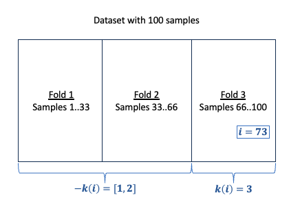

```@meta
CurrentModule = TMLE
```

# Estimation

## Estimating a single Estimand

```@setup estimation
using Random
using Distributions
using DataFrames
using StableRNGs
using CategoricalArrays
using TMLE
using LogExpFunctions
using MLJLinearModels
using MLJ

function make_dataset(;n=1000)
    rng = StableRNG(123)
    # Confounders
    W₁₁= rand(rng, Uniform(), n)
    W₁₂ = rand(rng, Uniform(), n)
    W₂₁= rand(rng, Uniform(), n)
    W₂₂ = rand(rng, Uniform(), n)
    # Covariates
    C = rand(rng, Uniform(), n)
    # Treatment | Confounders
    T₁ = rand(rng, Uniform(), n) .< logistic.(0.5sin.(W₁₁) .- 1.5W₁₂)
    T₂ = rand(rng, Uniform(), n) .< logistic.(-3W₂₁ - 1.5W₂₂)
    # Target | Confounders, Covariates, Treatments
    Y = 1 .+ 2W₂₁ .+ 3W₂₂ .+ W₁₁ .- 4C.*T₁ .- 2T₂.*T₁.*W₁₂ .+ rand(rng, Normal(0, 0.1), n)
    return DataFrame(
        W₁₁ = W₁₁, 
        W₁₂ = W₁₂,
        W₂₁ = W₂₁,
        W₂₂ = W₂₂,
        C   = C,
        T₁  = categorical(T₁),
        T₂  = categorical(T₂),
        Y   = Y
        )
end
dataset = make_dataset(n=10000)
scm = SCM([
    :Y  => [:T₁, :T₂, :W₁₁, :W₁₂, :W₂₁, :W₂₂, :C],
    :T₁ => [:W₁₁, :W₁₂],
    :T₂ => [:W₂₁, :W₂₂]
]
)
```

Once a statistical estimand has been defined, we can proceed with estimation. At the moment, we provide 3 main types of estimators:

- Targeted Maximum Likelihood Estimator (`TMLEE`)
- One-Step Estimator (`OSE`)
- Naive Plugin Estimator (`NAIVE`)

Drawing from the example dataset and `SCM` from the Walk Through section, we can estimate the ATE for `T₁`. Let's use TMLE:

```@example estimation
Ψ₁ = ATE(
    outcome=:Y, 
    treatment_values=(T₁=(case=true, control=false),),
    treatment_confounders=(T₁=[:W₁₁, :W₁₂],),
    outcome_extra_covariates=[:C]
)
tmle = TMLEE()
result₁, cache = tmle(Ψ₁, dataset);
result₁
nothing # hide
```

We see that both models corresponding to variables `Y` and `T₁` were fitted in the process but that the model for `T₂` was not because it was not necessary to estimate this estimand.

The `cache` contains estimates for the nuisance functions that were necessary to estimate the ATE. For instance, we can see what is the value of ``\epsilon`` corresponding to the clever covariate.

```@example estimation
ϵ = last_fluctuation_epsilon(cache)
```

The `result₁` structure corresponds to the estimation result and should report 3 main elements:

- A point estimate.
- A 95% confidence interval.
- A p-value (Corresponding to the test that the estimand is different than 0).

This is only summary statistics but since both the TMLE and OSE are asymptotically linear estimators, standard Z/T tests from [HypothesisTests.jl](https://juliastats.org/HypothesisTests.jl/stable/) can be performed.

```@example estimation
tmle_test_result₁ = OneSampleTTest(result₁)
```

We could now get an interest in the Average Treatment Effect of `T₂` that we will estimate with an `OSE`:

```@example estimation
Ψ₂ = ATE(
    outcome=:Y, 
    treatment_values=(T₂=(case=true, control=false),),
    treatment_confounders=(T₂=[:W₂₁, :W₂₂],),
    outcome_extra_covariates=[:C]
)
ose = OSE()
result₂, cache = ose(Ψ₂, dataset;cache=cache);
result₂
nothing # hide
```

Again, required nuisance functions are fitted and stored in the cache.

## CV-Estimation

When performing "vanilla" semi-parametric estimation, we are essentially using the dataset twice, once for the estimation of the nuisance functions and once for the estimation of the parameter of interest. This means that there is a risk of over-fitting and residual bias ([see here](https://arxiv.org/abs/2203.06469) for some discussion). One way to address this limitation is to use a technique called sample-splitting / cross-validating.

### Usage

To create a cross-validated estimator simply specify the `resampling` keyword argument:

```@example estimation
TMLEE(resampling=StratifiedCV());
```

or

```julia
OSE(resampling=StratifiedCV(nfolds=3));
```

We further explain below the procedure for both Targeted Maximum-Likelihood estimation and One-Step estimation and provide some considerations when using sample-splitting.

### Preliminaries

Even though the idea behind cross-validated estimators is simple, the procedure may seem obscure at first. The purpose of this subsection is to explain how it works, and it will be useful to introduce some notation. Let `resampling` be a `MLJ.ResamplingStrategy` partitioning the dataset into K folds. According to this `resampling` method, each sample ``i`` in the dataset belongs to a specific (validation) fold ``k``:

- ``k(i)`` denotes the (validation) fold sample ``i`` belongs to ``k(i) \in [1, K]``.
- ``-k(i)`` denotes the remaining (training) folds.

```@raw html
<div style="text-align:center">

</div>
```

The estimators we are considering are asymptotically linear. This means they can be written as an average over their influence function. If we denote by ``\phi`` this influence function, which itself depends on nuisance functions (e.g. outcome mean, propensity score...), then ``i \mapsto \hat{\phi}^{-k(i)}(i)`` is a cross-validated estimator of this influence function. The notation means that the nuisance functions learnt on all folds but the one containing sample ``i`` are used to make the prediction for sample ``i``. Here, we loosely refer to ``i`` as a sample (e.g. ``(Y, T, W)_i``), regardless of the actual data structure.

We are now ready to define the cross-validated One-Step and Targeted Maximum-Likelihood estimators.

### CV-OSE

The cross-validated One-Step estimator is the average of the cross-validated influence function, it can be compactly written as:

```math
\hat{\Psi}_{CV} = \frac{1}{n} \sum_{i=1}^n \hat{\phi}^{-k(i)}(i)
```

And the associated variance estimator:

```math
\hat{V}_{\Psi, CV} = \frac{1}{n-1} \sum_{i=1}^n (\hat{\phi}^{-k(i)}(i) - \hat{\Psi}_{CV})^2
```

### CV-TMLE


### Further Considerations

- Choice of `resampling` Strategy: The theory behind sample-splitting requires the nuisance functions to be sufficiently well estimated on **each and every** fold. A practical aspect of it is that each fold should contain a sample representative of the dataset. In particular, when the treatment and outcome variables are categorical it is important to make sure the proportions are preserved. This is typically done using `StratifiedCV`.
- Computational Complexity: Sample-splitting results in ``K`` fits of the nuisance functions, drastically increasing computational complexity. In particular, if the nuisance functions are estimated using (P-fold) Super-Learning, this will result in two nested cross-validation loops and ``K \times P`` fits.
- Caching of Nuisance Functions: Because the `resampling` strategy typically needs to preserve the outcome and treatment proportions, very little reuse of cached models is possible (see below).

## Caching model fits

Let's now see how the `cache` can be reused with a new estimand, say the Total Average Treatment Effect of both `T₁` and `T₂`.

```@example estimation
Ψ₃ = ATE(
    outcome=:Y, 
    treatment_values=(
        T₁=(case=true, control=false), 
        T₂=(case=true, control=false)
    ),
    treatment_confounders=(
        T₁=[:W₁₁, :W₁₂], 
        T₂=[:W₂₁, :W₂₂],
    ),
    outcome_extra_covariates=[:C]
)
result₃, cache = tmle(Ψ₃, dataset; cache=cache);
result₃
nothing # hide
```

This time only the model for `Y` is fitted again while reusing the models for `T₁` and `T₂`. Finally, let's see what happens if we estimate the `IATE` between `T₁` and `T₂`.

```@example estimation
Ψ₄ = IATE(
    outcome=:Y, 
    treatment_values=(
        T₁=(case=true, control=false), 
        T₂=(case=true, control=false)
    ),
    treatment_confounders=(
        T₁=[:W₁₁, :W₁₂], 
        T₂=[:W₂₁, :W₂₂],
    ),
    outcome_extra_covariates=[:C]
)
result₄, cache = tmle(Ψ₄, dataset; cache=cache);
result₄
nothing # hide
```

All nuisance functions have been reused, only the fluctuation is fitted!

## Composing Estimands

By leveraging the multivariate Central Limit Theorem and Julia's automatic differentiation facilities, we can estimate any estimand which is a function of already estimated estimands. By default, TMLE.jl will use [Zygote](https://fluxml.ai/Zygote.jl/latest/) but since we are using [AbstractDifferentiation.jl](https://github.com/JuliaDiff/AbstractDifferentiation.jl) you can change the backend to your favorite AD system.

For instance, by definition of the ``IATE``, we should be able to retrieve:

```math
IATE_{T_1=0 \rightarrow 1, T_2=0 \rightarrow 1} = ATE_{T_1=0 \rightarrow 1, T_2=0 \rightarrow 1} - ATE_{T_1=0, T_2=0 \rightarrow 1} - ATE_{T_1=0 \rightarrow 1, T_2=0}
```

```@example estimation
first_ate = ATE(
    outcome=:Y, 
    treatment_values=(
        T₁=(case=true, control=false), 
        T₂=(case=false, control=false)),
    treatment_confounders=(
        T₁=[:W₁₁, :W₁₂], 
        T₂=[:W₂₁, :W₂₂],
    ),
)
first_ate_result, cache = tmle(first_ate, dataset, cache=cache, verbosity=0);

second_ate = ATE(
    outcome=:Y, 
    treatment_values=(
        T₁=(case=false, control=false), 
        T₂=(case=true, control=false)),
    treatment_confounders=(
        T₁=[:W₁₁, :W₁₂], 
        T₂=[:W₂₁, :W₂₂],
    ),
    )
second_ate_result, cache = tmle(second_ate, dataset, cache=cache, verbosity=0);

composed_iate_result = compose(
    (x, y, z) -> x - y - z, 
    result₃, first_ate_result, second_ate_result
)
isapprox(
    estimate(result₄),
    estimate(composed_iate_result),
    atol=0.1
)
```
