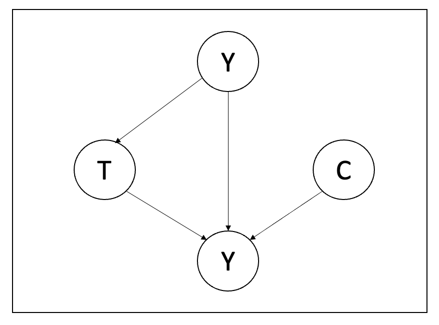
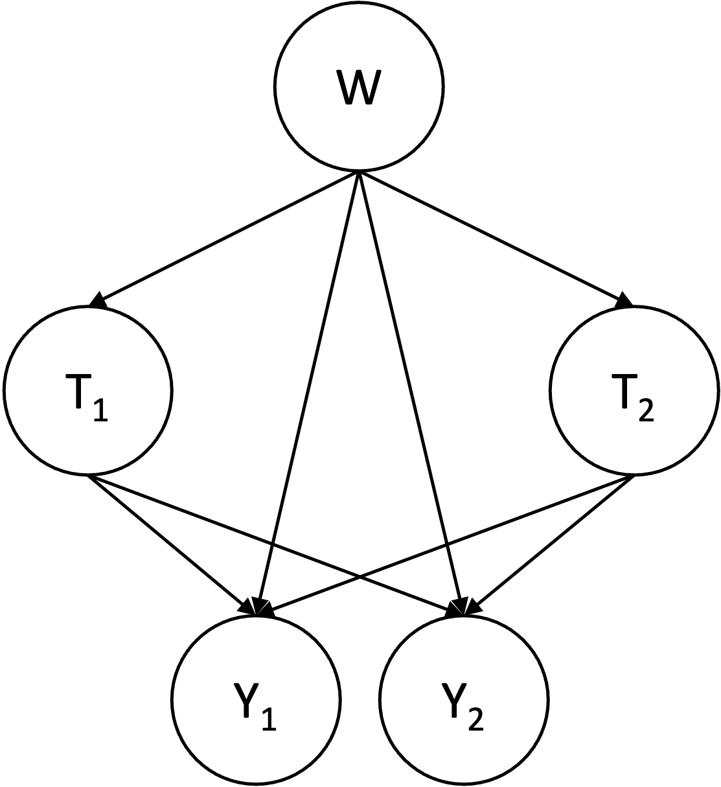

```@meta
CurrentModule = TMLE
```

# Structural Causal Models

In TMLE.jl, specifying a structural causal model (`SCM`) is optional but can be useful to reason about your data. It can also be used for causal identification, that is, converting a causal estimand into a statistical estimand which can be estimated from data. A `SCM` is a directed acyclic graph that describes the causal relationships between the random variables under study. However, it does not make any assumption on the functional form of these dependencies. The traditional `SCM` used in most causal inference studies is the following:



Where:

- ``Y`` is the outcome variable.
- ``T`` is a set of treatment variables whose effect on ``Y`` is of interest.
- ``W`` is a set of confounding variables affecting both ``Y`` and ``T``.
- ``C`` is a set of variables only influencing ``Y``.

We now explain how these models can be built in TMLE.jl.

## Incremental Construction

All models are wrong? Well maybe not the following:

```@example scm
using TMLE # hide
scm = SCM()
```

This model does not say anything about the random variables and is thus not very useful. Let's return to the `SCM` presented above and construct it step by step. First let's add the relationship between ``Y`` and its parents:

```@example scm
add_equation!(scm, :Y => [:T, :W, :C])
```

This model does not contain the relationship between ``T`` and ``W``, let's add it now:

```@example scm
add_equation!(scm, :T => [:W])
```

## One Step Construction

Instead of constructing the `SCM` incrementally, one can provide all the specified equations at once:

```@example scm
scm = SCM([
    :Y  => [:T, :W, :C],
    :T => [:W]
])
```

## Multiple Treatments

In many cases, there isn't a single treatment variable but many. Furthermore, each treatment may be confounded by a different set of variables. We can encode this structure within a `SCM`.

```@example scm
scm = SCM([
    :Y  => [:T₁, :T₂, :W₁, :W₂, :C],
    :T₁ => [:W₁],
    :T₂ => [:W₂]
])
```

## Classic Structural Causal Models

There are many cases where we are interested in estimating the causal effect of some treatment variables on some outcome variables. If all treatment variables share the same set of confounders, we can quickly define the associated `SCM` with the `StaticSCM` interface:

```@example scm
scm = StaticSCM(
    outcomes=[:Y₁, :Y₂], 
    treatments=[:T₁, :T₂], 
    confounders=[:W]
)
```

This `SCM` can be represented by the following illustration:



In the following section, we illustrate how the `SCM` can be used to convert a causal estimand in a statistical estimand.
